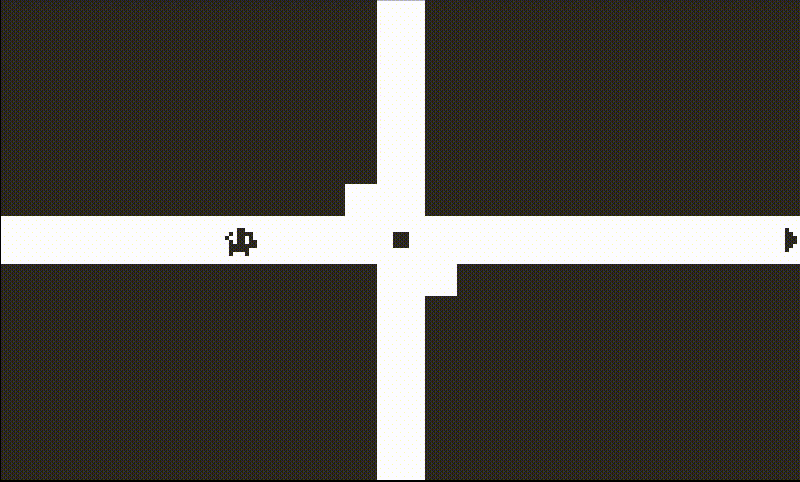
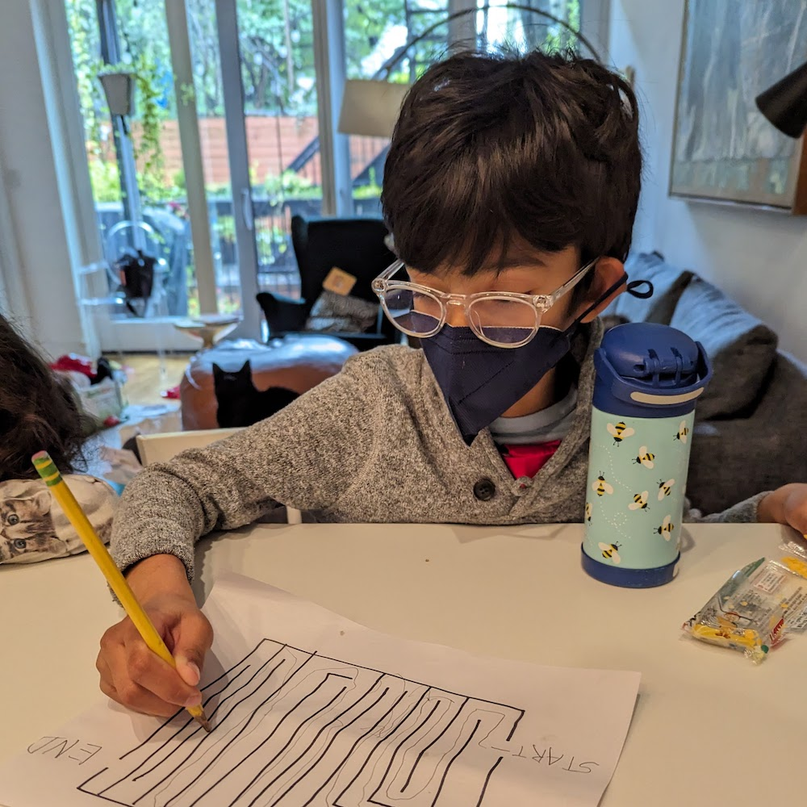
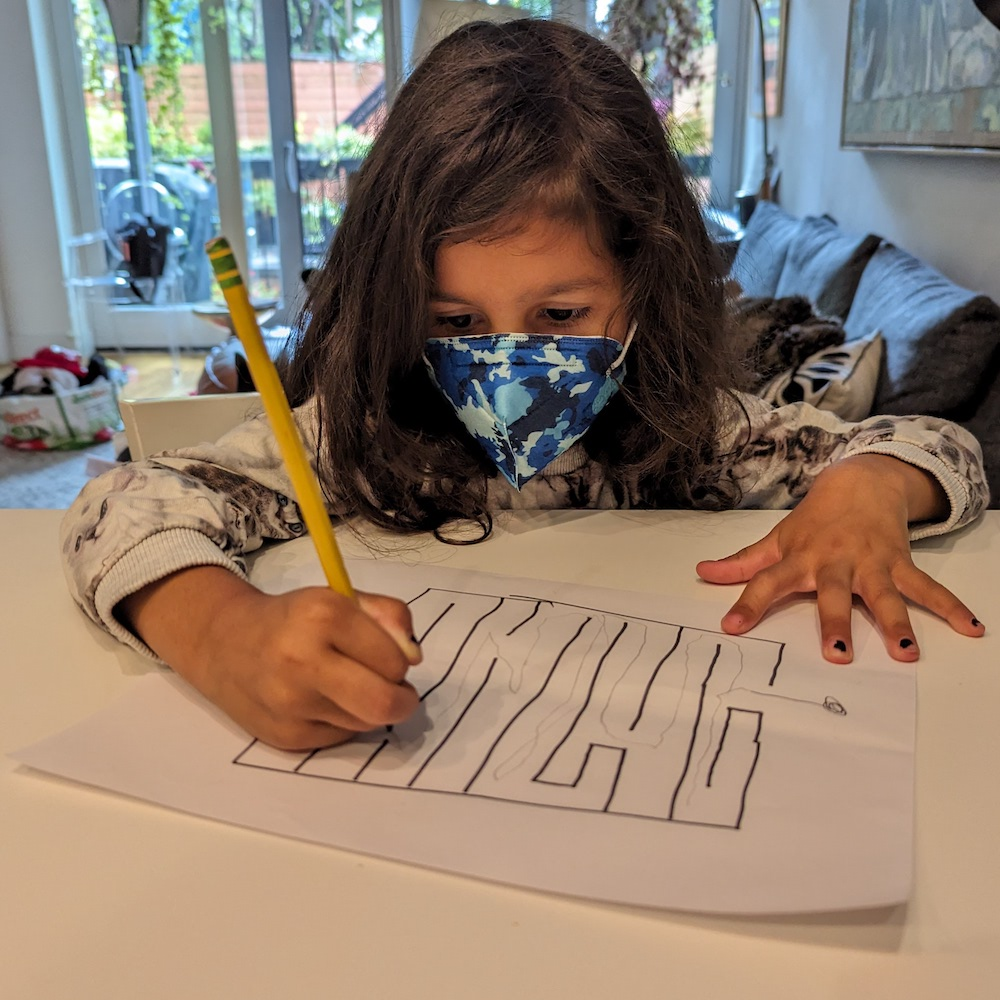
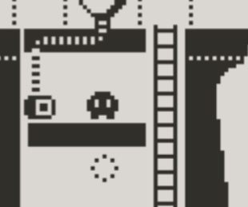
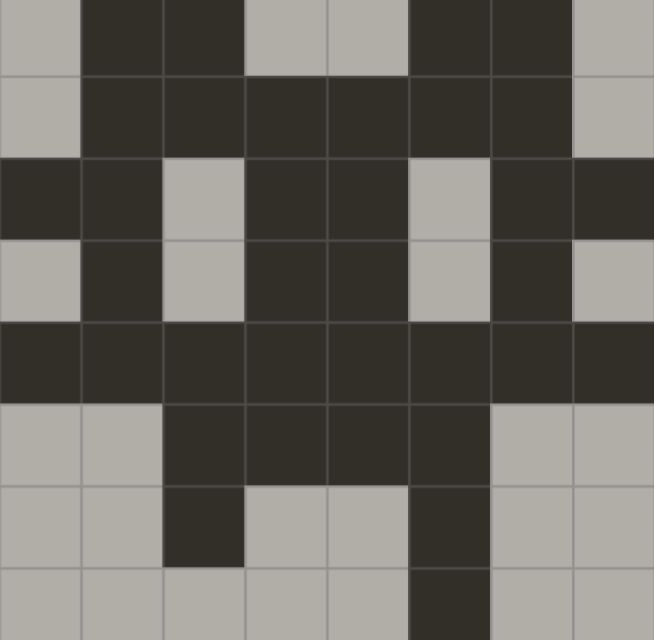

# Poco's Maze Adventure

### A kitty game for all ages 

 

## Motivation
In August 2023, my wife gave me a [Playdate](http://play.date), the new gaming system made by a [Portland-based indie game publisher](https://panic.com/) in collaboration with a [hip Swedish consumer electronics company](http://teenage.engineering).

The handheld device is small and bright yellow (a purple cover optional), with a black-and-white screen, d-pad, two buttons, and a crank. Within days, my kids (four & six years old) were understandably obsessed with it.

But funnily enough, despite screaming "I'm for kids," the thing is targeted at people like me -- adults who like short indie games and fondly remember their old GameBoy. Almost all the games made for the Playdate require reading, puzzle solving, or hand-eye-coordination that are out of reach for young kids. After a couple of days cycling through the "A/B game" (the device's bootup intro, which you can "replay" via settings) and [Music Box](https://tizian.itch.io/playdate-music-box) on repeat, I decided I should try making a actual game they could play.

## Game Design
That sounds ambitious, but Panic has an incredibly simple-but-powerful game maker for the Playdate called [Pulp](https://play.date/pulp/). After reading the docs, I figured a maze game would be straightforward to create with Pulp's built-in features. A quick "prototype" with my target audience confirmed I was headed in the right direction.

 

When my son (now six) was a toddler, he would make up stories about a little gray cat named Poco, so there was never a question as to who the game’s avatar would be. The actual character design is heavily inspired by [Ron Lent](https://www.ronlent.com/)’s awesome game [Eyeland](https://play.date/games/eyeland/) which was also made in Pulp.

 

Pretty early on, I had the idea that “the lights would go out” on Poco, and it was pretty rewarding to see how much more engaging and challenging that game mechanic ended up being for kids and adults alike. It made the game a little TOO hard for my daughter (age four), so I added a “night vision” feature to stop her from giving up in disgust whenever the lights went out. The game is only 300 lines of code and >200 of those lines are for the lights out and night vision features – almost everything else about the game is drag and drop.

## Publishing
At some point I’d spent enough time on the game that I figured I should publish it. Panic makes it really easy to “sideload” games from any source and there’s a thriving community of people posting all sorts of stuff on [itch.io](https://itch.io/games/tag-playdate). I figured it’d be worth a purchase if it had enough mazes to last ~10 minutes, given how eager kids are to play it repeatedly. I also figured I might as well donate the profits to charity – hopefully it’d raise more money than my [granola “business”](https://oolalagranola.com/).

Panic also curates a selection of games for the on-device [Catalog](https://play.date/games/) and I figured I might as well try for it – at worst, maybe they’d give me some useful feedback. I submitted Poco for consideration in November and it was a complete surprise and delight when they accepted the game. They scheduled Poco for the February Catalog Drop, so I had roughly two months to finish up the game.

## Music
Panic’s main feedback, which I completely agreed with, was that the game felt sonically empty. I had sound effects for various events, but the game was otherwise silent. I’d thought about making a sound every time Poco moved (that’s what Ron does in [Eyeland](https://play.date/games/eyeland/)) but cats are quiet and it made no sense for her to be clomping around. Background music would help and Pulp editor has a song composer, but everything I tried to make in it sounded terrible. I needed help.

I enlisted the help of my friend [Bill Wadman](https://billwadman.com). An accomplished photographer, Bill studied music in college and was game for an unpaid collab. “We don't get paid because it's for charity, but you can add video game music composer to your resume!” was the pitch =). I figured he’d compose an atmospheric puzzle game soundscape, but he instead saw Poco as an adventure game, which it absolutely is... very few of the mazes have wrong turns. As such, he composed a fun adventure theme for the game which after some initial hesitation I've come to love. Much <3 to Bill for giving Poco her theme song and putting up with my perfectionist tendencies throughout the collaboration.

Unfortunately, music composed in Pulp sounds harsh at higher volumes on the Playdate speaker and we didn't discover [Ron's rant/tips](https://devforum.play.date/t/share-your-tricks-for-the-pulp-music-editor/2162/8) until well after Bill had finished the theme, so that's why the music sounds a little quiet compared to other (non-Pulp) games -- we bumped the volume down to 60% to compensate.

## Charity
A few weeks before Poco was due, a friend was raving about [Flatbush Cats](https://www.flatbushcats.org/)'s affordable clinic and I decided that would be a perfect place to send the donations. Flatbush Cats provides services to helps rescue outdoor cats and make caring for them affordable so they can stay off the street.

I didn't know how to the end the game, so I asked my son where Poco was headed and he confidently answered that she was "going outside to play." There's an irony of taking the profits from a game about a cat going outside and spending it on the rescue of outdoor cats, but I'm pretty sure Poco wouldn't want it any other way.

 

## Acknowledgements
Many thanks to
- [Bill Wadman](https://billwadman.com) for the music
- [Ron Lent](https://www.ronlent.com/) for inspiration and highlighting just how much can be done in Pulp
- [Panic](https://panic.com) for sharing Poco with the world
- [Principles GI Coffee House](https://www.instagram.com/principlesbk) for when I needed to play with pixels outside of my house and talk about the game with adults
- [Public Records](https://publicrecords.nyc/) for the one afternoon when I forced myself to "mostly finish" the game and submit it for Catalog consideration
- My family and extended family of friends for the support and "user testing"
