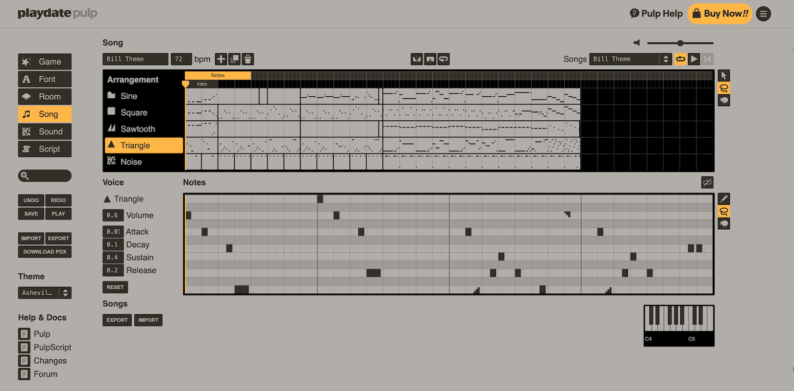
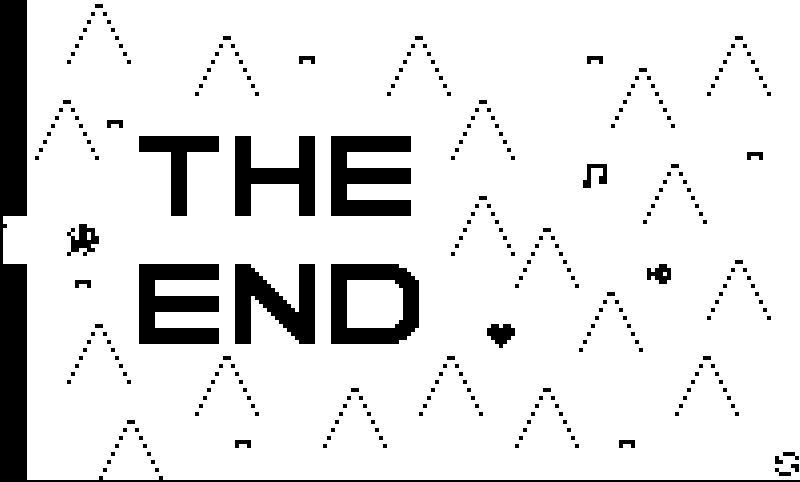

# Poco's Maze Adventure

### A kitty game for all ages 

 

## Motivation
In August 2023, my wife gave me a [Playdate](http://play.date), the new gaming system made by a [Panic (a Portland-based indie game publisher)](https://panic.com/) in collaboration with [Teenage Engineering (a hip Swedish consumer electronics company)](http://teenage.engineering).

The handheld device is small and bright yellow (purple cover optional), with a black-and-white screen, d-pad, two buttons, and crank. Within days, my kids (four & six years old) were understandably obsessed.

But despite screaming "for kids," the thing is targeted at people like me -- adults nostalgic about their GameBoys. Almost all the games on the Playdate require reading, puzzle solving, or hand-eye-coordination out of reach for young kids. After days of cycling through "The A/B game" (the Playdate's bootup sequence), [Music Box](https://tizian.itch.io/playdate-music-box), and [The Botanist](https://play.date/games/the-botanist/), I decided make a game they could properly play.

## Game Design
That might sound ambitious, but Panic has an incredibly simple-but-powerful game maker for the Playdate called [Pulp](https://play.date/pulp/). After reading the docs, I figured a maze game would be straightforward to create with Pulp's built-in features. A quick "prototype" with my target audience confirmed I was headed in the right direction.

 

When my son (now six) was a toddler, we would make up stories about a little gray cat named Poco, and so the protagonist was born. The actual character design is heavily inspired by [Ron Lent](https://www.ronlent.com/)’s awesome game [Eyeland](https://play.date/games/eyeland/) which was also made in Pulp.

 

Early on, I had the idea that “the lights would go out” on Poco and it was rewarding to see how engaging and challenging that mechanic ended up being for kids and adults alike. It made the game a little TOO hard for my daughter (age four), so I added a “night vision” feature to stop her from giving up in disgust whenever the lights went out. The game is only 300 lines of code and >200 of those lines are for the lights out and night vision features – almost everything else about the game is drag and drop.

## Publishing
Panic makes it easy to “sideload” games from anywhere and there’s a thriving community posting stuff on [itch.io](https://itch.io/games/tag-playdate). Given how eager kids are to play games on repeat, I figured Poco would be worth selling there if it had enough mazes to last ~10 minutes and I donated the profits to charity.

There's also a curated [game store ("Catalog")](https://play.date/games/) for the Playdate where Panic releases 5-10 games a month. I YOLO submitted Poco for consideration in November and it was a complete surprise and delight when they accepted the game. They scheduled Poco for the February Catalog Drop, so I had roughly two months to finish up the game.

## Music
Panic’s main feedback, which I completely agreed with, was that the game felt sonically empty. I had sound effects for various events, but the game was otherwise silent. I thought about making a sound every time Poco moved (that’s what Ron does in [Eyeland](https://play.date/games/eyeland/)) but cats are quiet and it made no sense for her to be clomping around. Background music would help and the Pulp editor has a song composer, but everything I tried to make in the composer sounded terrible. I needed help.

So I enlisted the help of my friend [Bill Wadman](https://billwadman.com). An accomplished photographer, Bill studied music in college and was game for an unpaid collab. “We don't get paid because it's for charity, but you can add video game music composer to your resume!” was the pitch 😃. I'd always thought of Poco as a puzzle game needing an atmospheric soundscape, but he instead saw Poco as an adventure game and composed a fun adventure theme. It caught me by surprise, but he was completely right: very few of the mazes have wrong turns and it's much more about enjoying the journey than it is using your brain. Once I wrapped my head around that, I came to love the music he composed and can't imagine the game without it.

Unfortunately, music composed in Pulp sounds harsh at higher volumes on the Playdate speaker and we didn't discover [Ron's rant/tips](https://devforum.play.date/t/share-your-tricks-for-the-pulp-music-editor/2162/8) until well after Bill had finished the theme, so that's why the music sounds a little quiet compared to other (non-Pulp) games -- we bumped the volume down to 60% to compensate.

## Charity
I've heard great things about [Flatbush Cats](https://www.flatbushcats.org/)' affordable clinic and decided that would be the perfect place to donate Poco's proceeds. Flatbush Cats provides services to helps rescue outdoor cats and makes caring for them affordable so they can stay off the street.

For the game's ending, I asked my son where Poco was headed and he confidently answered that she was "going outside to play." There's an irony of taking the profits from a game about a cat going outside and donating it to the rescue of outdoor cats, but I'm sure Poco wouldn't want it any other way.

 

## Acknowledgements
Many thanks to
- [Bill Wadman](https://billwadman.com) for the music and making Poco feel like a real thing
- [Ron Lent](https://www.ronlent.com/) for inspiration and highlighting just how much can be done in Pulp
- [Panic](https://panic.com) for sharing Poco with the world
- [Principles GI Coffee House](https://www.instagram.com/principlesbk) for when I needed to play with pixels outside of my house and talk about the game with adults
- [Public Records](https://publicrecords.nyc/) for the one afternoon when I forced myself to "mostly finish" the game and submit it for Catalog consideration
- My family and extended family of friends for the support and "user testing"
